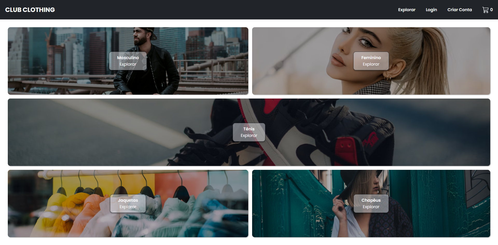

<h1 align="center">🛒 Club Clothing E-commerce 👔</h1>



<p align="justify">O Club Clothing é um e-commerce de roupas. O usuário pode se cadastrar e fazer login com o Google ou email e senha, navegar pelo catálogo de produtos, adicionar e remover produtos ao carrinho, e realizar pagamentos com o Stripe.</p>

> Status do Projeto: Concluido ✅

> Deploy disponível: Sim ✅

## 🏆 Principais funcionalidades
- Autenticação com Firebase Authentication.
  - Para efetuar pagamentos o usuário precisa estar logado ou se cadastrar na plataforma. É possível fazer isso usando sua conta do Google ou e-mail e senha.
- Pagamentos com o Stripe.
  - Após confirmar o pedido, o usuário é redirecionado para a página de pagamentos do stripe, onde pode simular uma compra através de um número de cartão fake  4242 4242 4242 4242.
- Outros:
   - Layout responsivo e estilização feita com Styled Components.
   - O projeto conta com testes unitários feitos com jest e Testing Library.

## 📚 Linguagens e libs utilizadas

- [React](https://reactjs.org/) 
- [TypeScript](https://www.typescriptlang.org/) 
- [React Router](https://reactrouter.com/en/main) 
- [React Hook Form](https://www.react-hook-form.com/)
- [Styled Components](https://styled-components.com/)
- [Firebase](https://firebase.google.com/)
- [Stripe](https://stripe.com/br)
- [Jest](https://jestjs.io/pt-BR/)
- [Testing Library](https://testing-library.com/)

## 🌐 Deploy da Aplicação com Netlify 

> https://club-ecommerce.netlify.app/

## ▶️ Como rodar a aplicação 

No terminal, clone o projeto:
```bash
git clone https://github.com/Viniciusrbr/Club-Clothing-Ecommerce.git
```

Entre na pasta do projeto:
```bash
cd Club-Clothing-Ecommerce
```

Instale as dependências:
```bash
npm install
```

Execute a aplicação:
```bash
npm run dev
```

Pronto, agora é possível acessar a aplicação a partir da rota http://localhost:5173/
